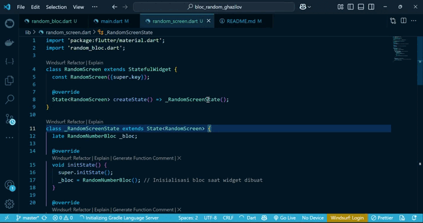

# bloc_random_ghazilov

A new Flutter project.

## SOAL 13 PRAKTIKUM 7: BLoC Pattern

- Jelaskan maksud praktikum ini ! Dimanakah letak konsep pola BLoC-nya ?
- Capture hasil praktikum Anda berupa GIF dan lampirkan di README.
- Lalu lakukan commit dengan pesan "P7: Jawaban Soal 13".

JAWABAN

1. Maksud Praktikum (BLoC Pattern)

Praktikum ini bertujuan untuk memperkenalkan pola BLoC (Business Logic Component) dalam pengembangan aplikasi Flutter. Dengan pola ini, kita memisahkan logika bisnis (seperti menghasilkan angka acak) dari tampilan UI, agar kode menjadi lebih bersih, mudah diatur, dan scalable.

 Letak Konsep Pola BLoC-nya
Konsep BLoC terlihat pada bagian berikut:
1.Stream & Sink digunakan untuk mengatur aliran data (streaming data):
- Stream<int> get randomNumber → digunakan untuk mengirim data ke UI.
- Sink<void> get generateRandom → digunakan UI untuk memicu aksi dari BLoC.

2.Logika bisnis berada di dalam BLoC (bukan di UI):
- Kode acak Random().nextInt(10) tidak ditulis langsung di layar (Widget) tapi di dalam RandomNumberBloc.

3.UI hanya mendengarkan Stream dan mengirim perintah lewat Sink:
- Misalnya, tombol memanggil bloc.generateRandom.add(null) untuk memicu logika di dalam BLoC.
- Hasil angka ditampilkan lewat StreamBuilder yang mendengarkan bloc.randomNumber.

Kesimpulan
Praktikum ini menunjukkan bagaimana logika aplikasi dan UI dapat dipisahkan dengan menggunakan BLoC pattern, yang membuat aplikasi lebih mudah diuji, dirawat, dan dikembangkan ke depannya.

2. Hasil ScreenCapture 

3. Commit Done